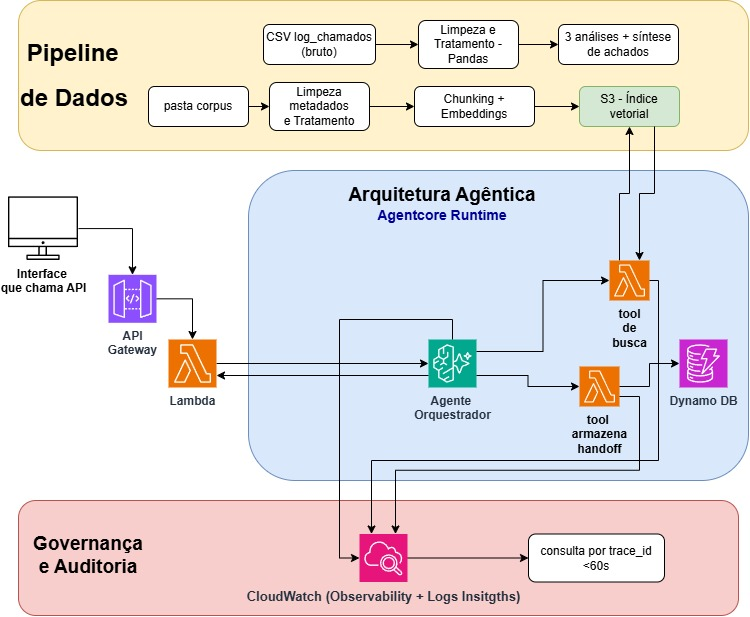

# Concierge ConectaTel

Assistente GenAI de atendimento para a operadora fictícia ConectaTel, com pipeline de dados, RAG sobre o corpus oficial, filtro determinístico de vigência, triagem, escalonamento com handoff e trilha de auditoria.

Este README é um guia técnico de execução para avaliadores e pessoas externas à squad.

## Mapa rápido

- [`src/`](src/): código executável, organizado pelas cinco partes da solução.
- [`tests/`](tests/): testes espelhados por domínio funcional.
- [`docs/`](docs/): contratos, decisões, arquitetura, QA e materiais de entrega.
- [`data/`](data/): somente entradas e exemplos pequenos.
- [`artifacts/`](artifacts/): evidências e saídas de execução.
- [`infra/`](infra/): configurações reproduzíveis de infraestrutura, sem segredos.

O conteúdo original dos notebooks, módulos, testes e imagens permanece nas
pastas correspondentes; este mapa é a camada de navegação do repositório.

## 1. Arquitetura da solução



Arquivos oficiais: [arquitetura original](docs/arquitetura/arquitetura_conectatel_planejada.jpg) e [arquitetura final](docs/arquitetura/arquitetura_conectatel_final.jpg). A comparação está em [planejado versus executado](docs/arquitetura/planejado_vs_executado.md).

Fluxo: log CSV → Pandas → achados de design. Corpus → S3 → chunking/metadados → embeddings/índice. Pergunta → Lambda → filtro `status=vigente` → busca → limiar → resposta grounded, “não sei” ou escalonamento → audit trail.

## 2. Pré-requisitos

- Python 3.11 ou superior.
- AWS CLI configurado na conta de consolidação.
- Região AWS usada pela squad nas sprints anteriores.
- Permissões mínimas para S3 e Amazon Bedrock. Para Lambda, role equivalente.
- Acesso ao modelo aprovado no Bedrock e AWS Budget de baixo valor ativo.
- Log CSV e corpus documental oficiais fornecidos no pacote do desafio.

O projeto não usa API key externa. Use credenciais AWS padrão, profile ou role. Nunca grave chaves no repositório.

## 3. Instalação

```bash
git clone https://github.com/cleidyanne-castro/concierge-conectatel.git
cd concierge-conectatel
python -m venv .venv
source .venv/bin/activate
pip install -r requirements.txt
cp .env.example .env
```

Edite `.env` com região, bucket, caminho do índice, limiar de recuperação e modelo Bedrock.

## 4. Entrada de dados

Coloque o log em `data/call_log.csv` e os documentos em `data/corpus/`. Para versões diferentes da mesma política, use nomes como `politica_fatura__vigente.txt` e `politica_fatura__revogado.txt`.

Os metadados devem conter `doc_family_id`, `version_ordinal`, `effective_from`, `effective_to` e `status`. O corpus oficial do desafio é a única fonte autorizada para as respostas.

## 5. Execução

### Parte 1: Pipeline de dados

Execute o notebook [`01_bronze_ingestao.ipynb`](src/parte_01_dados/01_bronze_ingestao.ipynb)
no ambiente Databricks configurado pela squad. A execução gera os snapshots,
relatórios, análises e metadados descritos em `docs/parte_01_dados/`.

### Parte 2: Base de conhecimento e RAG

Use os arquivos locais entregues no handoff em
`docs/parte_02_rag/data_handoff.md`. O código de chunking, embeddings e índice
será executado pela Parte 2. O filtro `status=vigente` deve ocorrer antes da
similaridade. Prompt sozinho não atende ao requisito de vigência.

### Partes 3 e 4: Agente e escalonamento

```bash
python -m src.cli --question "<pergunta do assinante>"
```

O resultado deve conter `trace_id` e uma decisão: `responder`, `nao_sei` ou `escalar`. O adaptador real do Bedrock está em `src/parte_03_agente/bedrock_client.py`. O modo local permite validar o fluxo sem credenciais.

## 6. Testes e evidências

```bash
python -m pytest -q
```

As evidências finais devem conter 10 a 15 transcrições textuais. Devem incluir duas respostas com fonte vigente, duas perguntas sobre versão revogada, duas sem fonte com “não sei” e dois escalonamentos distintos com handoff completo. Também devem cobrir perguntas não preparadas, consulta do `trace_id` em até 60 segundos e execução do README por membro diferente do autor da configuração.

As evidências da Parte 1 estão em [`artifacts/audit/`](artifacts/audit/), com
registros visuais da Bronze, do Workflow, da Silver e da dashboard.

## 7. Auditoria e governança

Cada resposta registra pergunta, fontes, decisão, guardrail e `trace_id`. O registro local fica em `artifacts/audit/audit.jsonl`. `find_by_trace_id()` localiza uma interação. A entrega final deve documentar IAM de menor privilégio, guardrails, riscos, AWS Budgets e limpeza de recursos contínuos.

## 8. Estrutura do repositório

- `src/`: pipeline, RAG, agente, política e auditoria.
- `tests/`: testes automatizados.
- `data/`: entradas oficiais e exemplos de smoke test.
- `docs/arquitetura/`: arquitetura final aprovada pela squad.
- `docs/relatorio/`: documento principal.
- `docs/transcricoes/`: registros dos testes.
- `docs/qa/`: evidências e checklist.
- `docs/apresentacao/`: slides da banca.
- `infra/`: configuração e documentação AWS.
- `artifacts/`: saídas locais. Não versionar dados gerados.

## 9. Troubleshooting

- `AccessDenied` no Bedrock: valide região, role/profile e acesso ao modelo.
- Índice ausente: execute a Parte 2 e confira `VECTOR_STORE_PATH`.
- Tudo retorna “não sei”: confirme índice, limiar e documentos `vigente`.
- Documento revogado aparece: corrija o filtro antes do score e repita os testes.
- `trace_id` ausente: confira `AUDIT_LOG_PATH` e a execução do handler.

## 10. Entrega

Valide este README do zero em uma conta de consolidação, revise documento, transcrições, slides, código e vídeo plano B. Crie a tag `v1.0-entrega` e demonstre exatamente essa versão congelada.
