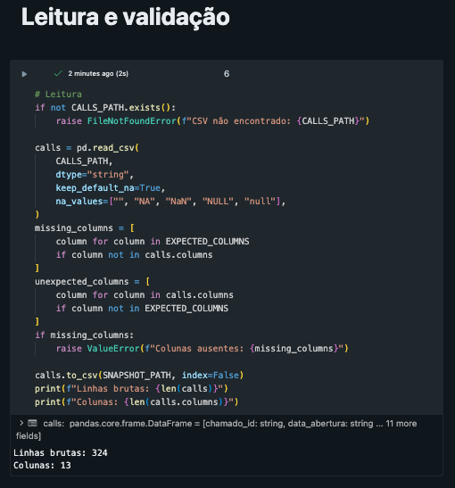
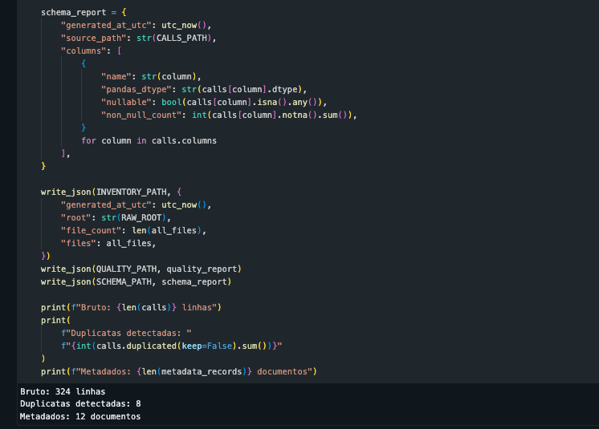

# Evidência de execução da Bronze

## Identificação

- Camada: Bronze
- Notebook: `src/parte_01_dados/01_bronze_ingestao.ipynb`
- Compute: Serverless
- Status: `Succeeded`

## Resultado validado

- CSV carregado com sucesso
- Schema validado com 13 colunas
- 324 linhas brutas identificadas
- 8 ocorrências em duplicatas exatas identificadas
- 12 documentos do corpus mapeados
- Inventário, qualidade, schema e metadados persistidos
- Bronze preservada sem deduplicação

## Evidência visual

Descrição de acessibilidade: Resultado do notebook Bronze no Databricks mostrando o carregamento de 324 linhas e a validação das 13 colunas esperadas do CSV.

Descrição de acessibilidade: Resultado do notebook Bronze no Databricks mostrando a detecção de 8 ocorrências em duplicatas, o mapeamento de 12 documentos e a persistência dos relatórios da Bronze.

## Escopo da evidência

As capturas comprovam a leitura, a validação do schema, o diagnóstico inicial e
o mapeamento do corpus. A deduplicação permanece como responsabilidade da
Silver, preservando a fidelidade do insumo original na Bronze.
