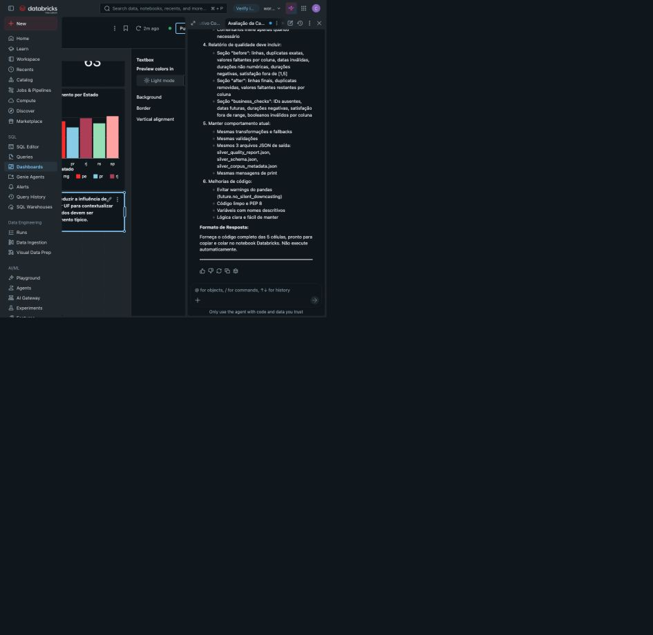

# Evidência do dashboard da Gold

## Identificação

- Dashboard: Concierge ConectaTel | Visão Executiva
- URL: https://dbc-36028e99-209d.cloud.databricks.com/sql/dashboardsv3/01f1a30ace9519a2b1631e362e222792
- Dashboard ID: `01f1a30ace9519a2b1631e362e222792`
- Branch do Git folder: `feat/gold-analises`
- Job: `conectatel-medallion-pipeline`
- Run ID: `1024940207488253`
- Compute: Serverless
- Status: `Succeeded`

## Escopo validado

- 320 chamados processados
- Satisfação média de 3.46
- Taxa de resolução no primeiro contato com numerador e denominador
- Taxa de encaminhamento humano com numerador e denominador
- Filtros por canal, categoria, estado e plano atual
- Volume por categoria e subcategoria
- Resolução no primeiro contato por canal
- Duração mediana por UF
- Tabela de apoio com volume e duração por UF

## Controles de qualidade

- Siglas e nomes completos de estados foram convergidos para a UF canônica na Silver.
- A visualização geográfica apresenta `ba`, `ce`, `mg`, `pe`, `pr`, `rj`, `rs` e `sp`.
- A duração usa mediana para reduzir a influência de outliers.
- Grupos com baixa representatividade devem ser avaliados junto do volume.
- Não há ocorrência de `#ERROR` nos indicadores verificados.
- A nota metodológica não apresenta estados duplicados nem percentuais inventados.

## Evidência visual

## Reprodutibilidade

O dashboard foi atualizado depois da execução do Workflow. A sequência confirmada foi Bronze, Silver e Gold. O arquivo visual desta evidência está versionado nesta mesma pasta.
