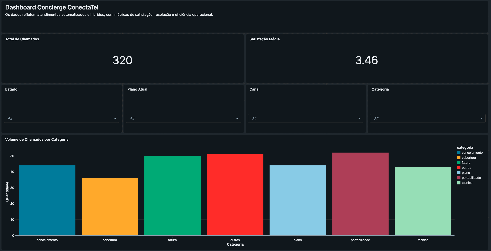
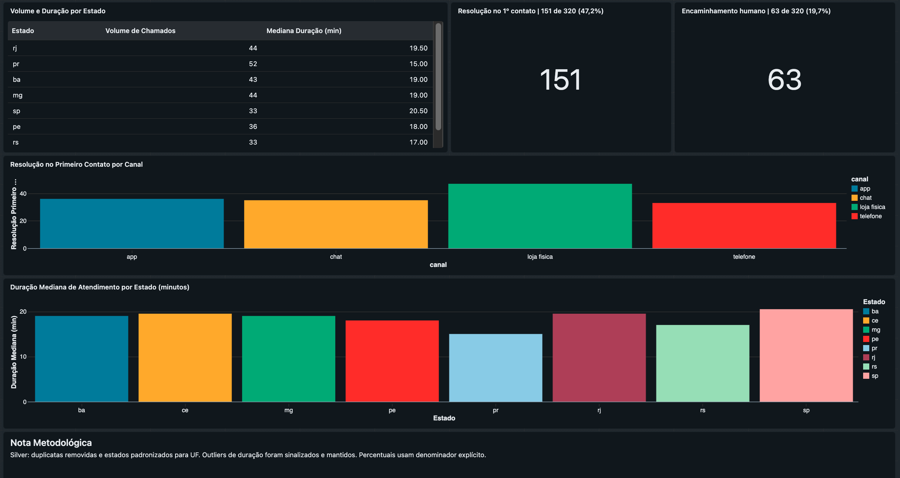

# Evidência do dashboard da Gold

## Identificação

- Dashboard: Concierge ConectaTel | Visão Executiva
- URL: https://dbc-36028e99-209d.cloud.databricks.com/sql/dashboardsv3/01f1a30ace9519a2b1631e362e222792
- Dashboard ID: `01f1a30ace9519a2b1631e362e222792`
- Branch do Git folder: `feat/gold-analises`
- Job: `conectatel-medallion-pipeline`
- Run ID: `1024940207488253`
- Compute: Serverless
- Status: `Succeeded`

## Escopo validado

- 320 chamados processados
- Satisfação média de 3.46
- Taxa de resolução no primeiro contato com numerador e denominador
- Taxa de encaminhamento humano com numerador e denominador
- Filtros por canal, categoria, estado e plano atual
- Volume por categoria e subcategoria
- Resolução no primeiro contato por canal
- Duração mediana por UF
- Tabela de apoio com volume e duração por UF

## Controles de qualidade

- Siglas e nomes completos de estados foram convergidos para a UF canônica na Silver.
- A visualização geográfica apresenta `ba`, `ce`, `mg`, `pe`, `pr`, `rj`, `rs` e `sp`.
- A duração usa mediana para reduzir a influência de outliers.
- Grupos com baixa representatividade devem ser avaliados junto do volume.
- Não há ocorrência de `#ERROR` nos indicadores verificados.
- A nota metodológica não apresenta estados duplicados nem percentuais inventados.

## Evidência visual

Descrição de acessibilidade: Dashboard executivo com 320 chamados, satisfação
média de 3,46, filtros por estado, plano, canal e categoria e volume de
chamados por categoria.

Descrição de acessibilidade: Dashboard operacional com volume e duração
mediana por estado, resolução no primeiro contato por canal, encaminhamento
humano e nota metodológica sobre qualidade e interpretação dos dados.

As capturas foram feitas manualmente na visualização publicada, sem o painel de
conversa do Genie.

O gráfico de resolução por canal mostra contagens de chamados resolvidos no
primeiro contato. Ele não deve ser interpretado como taxa de eficiência sem o
total de chamados recebidos por canal.

## Organização das evidências da Parte 1

As evidências estão separadas por etapa para facilitar a conferência:

- Bronze: [evidência de leitura e validação](bronze_read_validation.png) e
  [evidência de metadados e persistência](bronze_metadata_persistence.png).
- Silver: [leitura](silver_read_validation.png), [limpeza](silver_cleaning_result.png)
  e [persistência dos metadados](silver_persistence_metadata.png).
- Workflow: [execução Bronze, Silver e Gold](gold_workflow_execution_evidence.png).
- Gold: [visão geral](gold_dashboard_evidence.png) e [indicadores operacionais](gold_dashboard_operacao_evidence.png).

Cada imagem é acompanhada por uma descrição de acessibilidade imediatamente
abaixo. Os relatórios completos de execução permanecem nos arquivos Markdown
correspondentes de cada camada.

## Reprodutibilidade

O dashboard foi atualizado depois da execução do Workflow. A sequência confirmada foi Bronze, Silver e Gold. O arquivo visual desta evidência está versionado nesta mesma pasta.
