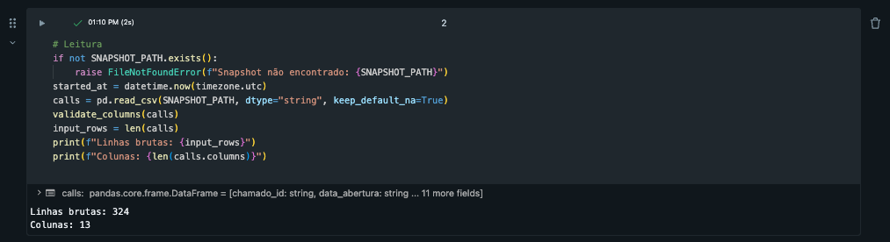
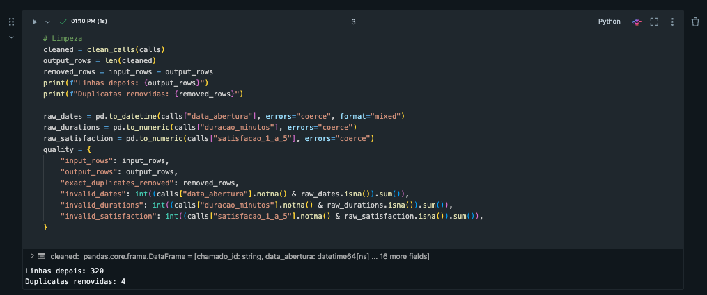
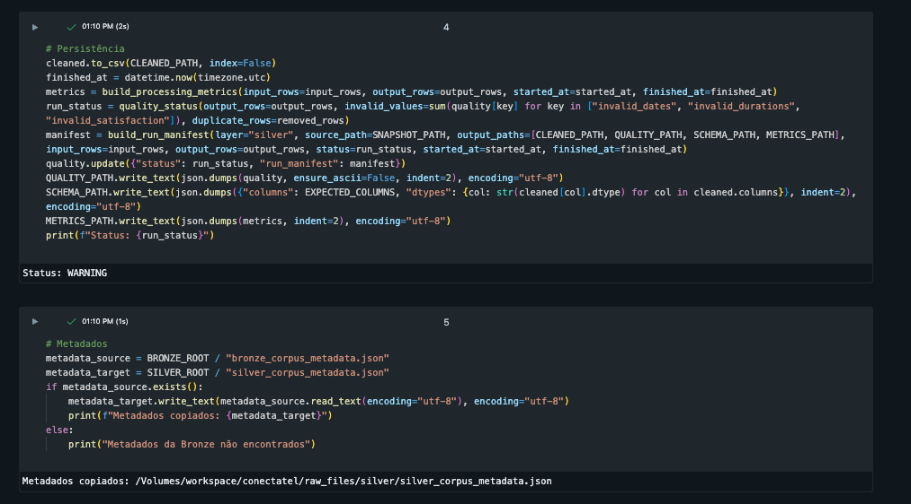

# Evidência de execução da Silver

## Identificação

- Camada: Silver
- Notebook: `src/parte_01_dados/02_silver_limpeza.ipynb`
- Branch: `feat/silver-dados`
- Merge em `main`: `52127d0`
- Data do registro: 2026-08-28

## Validações locais

- Comando: `pytest -q`
- Resultado: `5 passed`
- Notebook: JSON válido, com 5 células de código
- Escopo: somente arquivos da Silver

## Execução no Databricks

- Data/hora aproximada: `2026-08-28T15:38Z`
- Compute: Serverless
- Linhas lidas: `324`
- Linhas gravadas: `320`
- Duplicatas removidas: `4`
- Status da qualidade: `WARNING`
- Metadados: copiados com sucesso
- Células: `5/5` executadas com sucesso

## Resultados publicados no Databricks

Complementos da execução:

- Usuário: `cleidyannecastro.tech@gmail.com`
- Caminhos de saída:
  - `/Volumes/workspace/conectatel/raw_files/silver/silver_calls_cleaned.csv`
  - `/Volumes/workspace/conectatel/raw_files/silver/silver_quality_report.json`
  - `/Volumes/workspace/conectatel/raw_files/silver/silver_schema.json`
  - `/Volumes/workspace/conectatel/raw_files/silver/silver_processing_metrics.json`
- A execução foi realizada no notebook do workspace Databricks. Os resultados
  foram registrados nesta evidência e os arquivos de saída permanecem no
  Volume do projeto.

## Evidência visual

Descrição de acessibilidade: Resultado do notebook Silver mostrando a leitura do snapshot da Bronze, a validação das colunas e o carregamento de 324 linhas brutas.

Descrição de acessibilidade: Resultado do notebook Silver mostrando a limpeza concluída, 320 linhas após o tratamento e 4 duplicatas removidas.

Descrição de acessibilidade: Resultado do notebook Silver mostrando o status WARNING esperado, a persistência dos artefatos e a cópia dos metadados da Bronze para o Volume da Silver.

## Observação

Os testes locais, a estrutura do notebook e a execução no Databricks foram
validados. O status `WARNING` é esperado porque a Silver identificou e removeu
duplicatas exatas do conjunto de entrada.
