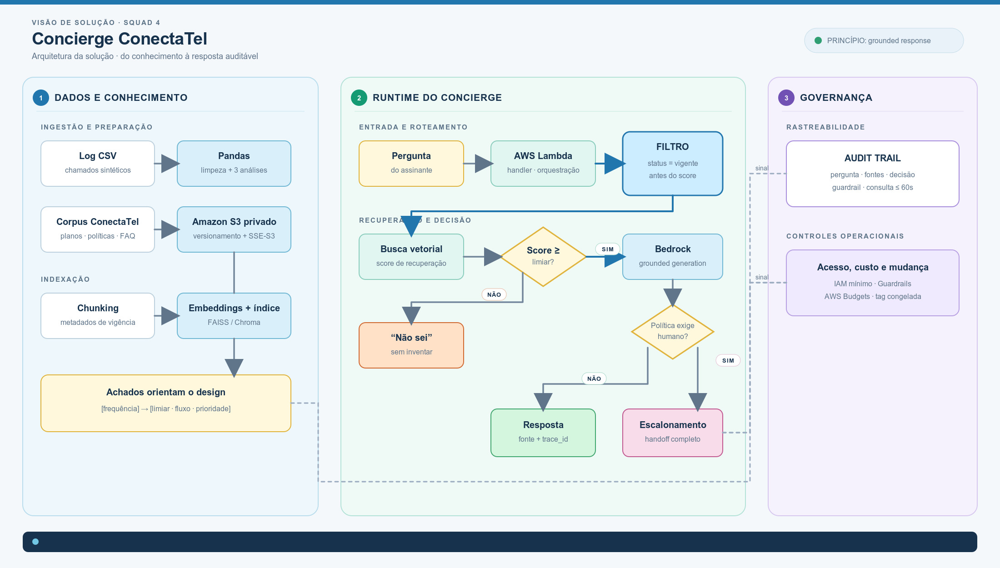

# Arquitetura do Concierge ConectaTel

## Arquitetura original planejada

Os documentos de planejamento do GitHub descrevem a separação entre pipeline
de dados, base de conhecimento, agente, escalonamento e governança.

Arquivo da arquitetura original: `arquitetura_conectatel_planejada.jpg`.

## Arquitetura final

O diagrama abaixo registra a arquitetura consolidada após a implementação das
partes de Engenharia de Dados, RAG, agente, escalonamento e auditoria.

Arquivo original anexado pela squad: `arquitetura_conectatel_final.jpg`.

## Evolução

A arquitetura original representa o desenho de referência. A arquitetura
final mantém esse escopo e explicita os componentes entregues, os contratos
entre as equipes e os pontos que dependem da configuração do ambiente.

## Planejado e executado

| Área | Planejado | Executado | Evidência |
|---|---|---|---|
| Pipeline de dados | CSV de chamados e corpus tratados para consumo das etapas seguintes | Bronze, Silver e Gold implementadas com Pandas, CSV, JSON e Markdown | `docs/parte_01_dados/` |
| Base de conhecimento | Limpeza de metadados, chunking e embeddings | Handoff documentado com vigência, versão, fonte e contrato de chunk | `docs/parte_02_rag/data_handoff.md` |
| Índice e busca | Índice vetorial consumido pelo agente | Fluxo previsto no desenho final, com responsabilidades documentadas | `README.md` |
| Agente | Orquestração de respostas com fonte vigente | Agente, busca, limiar e decisão documentados no escopo do projeto | `README.md` |
| Escalonamento | Handoff para atendimento humano | Handoff e persistência da decisão previstos na arquitetura | `docs/parte_01_dados/engenharia_dados.md` |
| Governança | Observabilidade, auditoria e consulta por `trace_id` | Trilha de auditoria, evidências e requisito de consulta em até 60 segundos | `docs/qa/` e `artifacts/audit/` |
| Automação | Dependência Bronze, Silver e Gold | Workflow Job publicado e executado com tarefas dependentes | `infra/databricks_workflow_gold.json` |

## Leitura do fluxo

1. A interface envia a pergunta para o API Gateway.
2. A Lambda encaminha a solicitação ao agente orquestrador.
3. O agente usa busca documental e regras de escalonamento.
4. A busca consulta o índice vetorial e aplica o filtro de vigência.
5. O sistema responde com fonte, informa quando não há evidência ou cria um handoff.
6. CloudWatch registra observabilidade e auditoria.

## Limites

O diagrama representa a arquitetura final do projeto. A criação efetiva de
alguns recursos de infraestrutura, como índice vetorial, ferramentas AWS e
dashboard, depende da configuração das equipes responsáveis e do ambiente de
execução.
