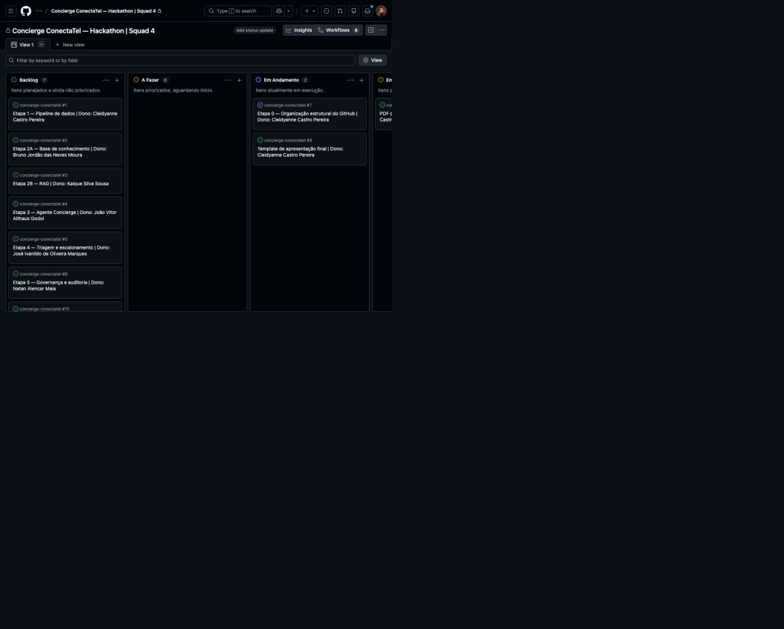

# Registros de Cleidyanne Castro Pereira

## Fundação do projeto

- criação e organização inicial do repositório GitHub da squad.
- estruturação das pastas por etapa do desafio.
- definição do fluxo de colaboração com branches, Pull Requests, revisão e merge.
- criação do README operacional para avaliadores e pessoas externas à squad.
- registro das regras para testes, evidências, auditoria e reprodução.

## Arquitetura inicial

- criação da arquitetura inicial como base de discussão.
- documentação da comparação entre planejado e executado.
- registro da arquitetura Medallion com Bronze, Silver e Gold.
- conexão entre pipeline de dados, RAG, agente, triagem e governança.

As imagens e o comparativo estão em [`docs/arquitetura/`](arquitetura/).

## Engenharia de Dados

- implementação e evolução da Bronze, Silver e Gold.
- criação de contratos, regras de qualidade, testes e evidências.
- execução das camadas no Databricks.
- criação do Workflow Job com dependências Bronze, Silver e Gold.
- registro dos resultados e limitações para a banca.

O detalhamento técnico está em [`docs/parte_01_dados/`](parte_01_dados/).

## Integração com as próximas partes

- documentação do handoff para Chunking e Embeddings.
- definição dos metadados de vigência e dos campos que devem acompanhar cada chunk.
- orientação para uso exclusivo de fontes vigentes.
- preservação da rastreabilidade até o documento original.
- alinhamento dos limites entre dados, RAG, agente, triagem e governança.

O contrato de integração está em [`docs/parte_02_rag/data_handoff.md`](parte_02_rag/data_handoff.md).

## Organização colaborativa

O quadro oficial é o [GitHub Projects da Squad 4](https://github.com/users/cleidyanne-castro/projects/1).

A imagem registra as etapas, responsáveis e estados do fluxo Kanban no momento
da documentação. O arquivo está em
[`docs/arquitetura/github_projects_kanban.jpg`](arquitetura/github_projects_kanban.jpg).

## Apresentação e relatório

- criação da apresentação executiva
- a apresentação executiva está em preparação em [`docs/apresentacao/PLACEHOLDER.md`](apresentacao/PLACEHOLDER.md).
- criação do relatório colaborativo considerando os entregáveis e escopo do projeto
- o relatório colaborativo está em preparação em [`docs/relatorio/PLACEHOLDER.md`](relatorio/PLACEHOLDER.md).

## Rastreabilidade

Os commits e Pull Requests associados às contribuições ficam registrados no
histórico do GitHub. 
